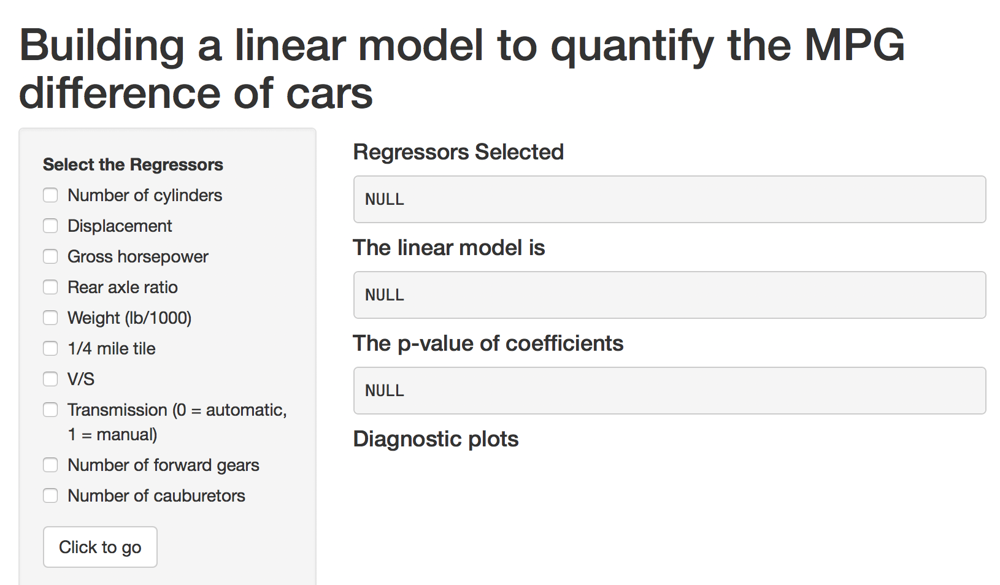
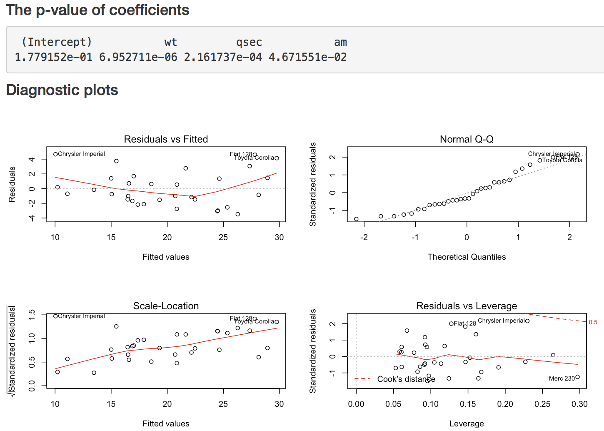

Chapter9Project
========================================================
author: Li Xiaowei
date: Mon Oct 12 22:21:20 2015
transition: rotate

This presentation describes how my [shiny appliation](https://lxwvictor.shinyapps.io/Chapter9Project) works


Overview of the App
========================================================
transition: linear

Below screenshot show the overview of the shiny app.
- The left side is the input panel, right side is output panel
- There is also a short documention about how to use the app not captured in below screenshot


How the app works
========================================================
transition: linear

There are 11 variables of the mtcars dataset. But which one(s) of the 10 variables can be used to predict the mpg and how is the performance?

Use this application by just choosing the different variables it will calculate the p-value of the coefficients and make the diagnostic plots, which will be used to evaluate the performance of current model.


```r
names(mtcars)
```

```
 [1] "mpg"  "cyl"  "disp" "hp"   "drat" "wt"   "qsec" "vs"   "am"   "gear"
[11] "carb"
```

Find the best model by using step function
========================================================
transition: linear

Let's try with the best model given by the step function. The variables are _wt, qsec_ and _am_.

```r
full.model <- lm(mpg ~ ., data = mtcars)
reduced.model <- step(full.model, direction = "backward")
```

```
             Estimate Std. Error   t value     Pr(>|t|)
(Intercept)  9.617781  6.9595930  1.381946 1.779152e-01
wt          -3.916504  0.7112016 -5.506882 6.952711e-06
qsec         1.225886  0.2886696  4.246676 2.161737e-04
am           2.935837  1.4109045  2.080819 4.671551e-02
```

Result of the best model
===
transition: linear

Based on the result calculated from previous slide. The p-value and diagnostic plot shown as below.

